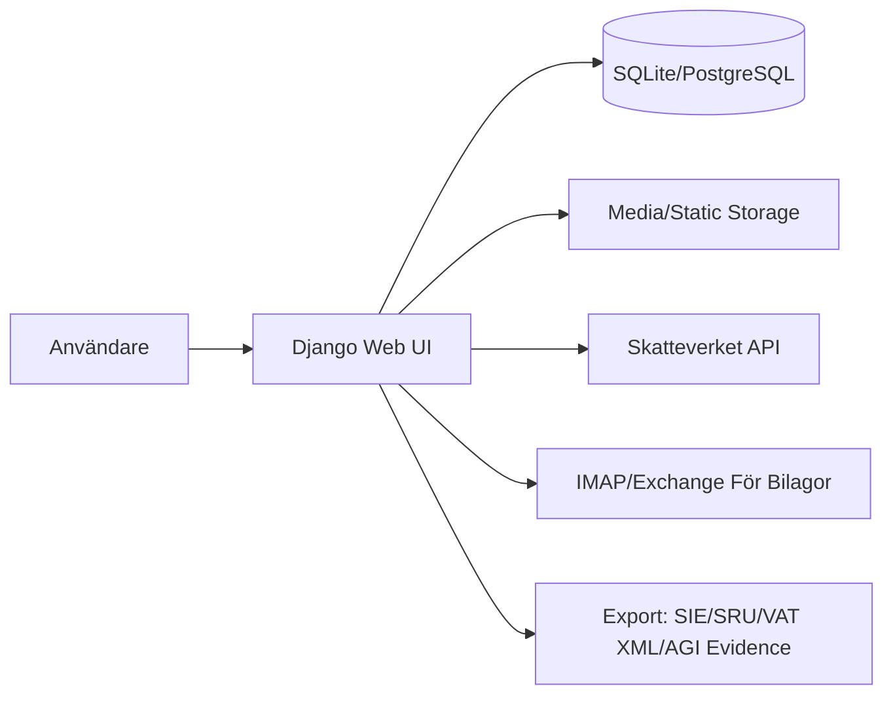

# SaldoVibe: Systemspecifikation För Att Återskapa Motsvarande Lösning

Datum: 2026-07-09
Målgrupp: Agent/utvecklare som ska bygga ett funktionellt motsvarande system (inte bit-for-bit-klon).

## 1. Syfte Och Omfattning

Bygg ett svenskt bokföringssystem med fokus på:

- Löpande bokföring (verifikationer, kontoplan, räkenskapsår)
- Kund- och leverantörsfakturor med bokföringsflöden
- Bank- och skattekontotransaktioner (import + matchning + bokföring)
- Momsrapportering enligt Skatteverkets fältmodell
- Lön med AGI-underlag, bokföring och rapportbevis
- Anläggningstillgångar och månadsavskrivning
- Bilagor/underlag inklusive e-postimport
- Revisionsspår med hashkedja
- Complianceöversikt och exportflöden (SRU, SIE)

Avgränsning:

- Målsystemet ska vara funktionslikt. Intern implementation kan skilja sig.
- Webbapp (Django), driftsatt via Docker.

## 2. Teknisk Baslinje

- Backendramverk: Django 5.2.x (LTS)
- Databas: SQLite (dev) och PostgreSQL (produktion)
- Auth: Egen user-modell med e-post som inloggnings-id
- Frontend: Django templates + Bootstrap + Chart.js
- Rapport/PDF: xhtml2pdf
- QR-generering: qrcode
- Fil/PDF-thumbnail: Pillow + PyMuPDF
- Produktionsserver: Gunicorn + WhiteNoise (+ valfri Nginx framför)

## 3. Hög Nivå-Arkitektur

Domänappar:

- accounts
- bookkeeping
- attachments
- auditlog
- banking
- supplier_invoices
- invoicing
- payroll
- vat
- fixed_assets

## 4. Roller Och Behörighet

Minimikrav:

- Vanlig autentiserad användare för normal registrering/bokföring
- Compliance-styrda åtgärder med rollmatris:
- finance_operator
- finance_admin
- system_admin

Action-baserad policy (exempel som måste finnas):

- Hantera periodlås
- Radera räkenskapsår/företag
- Export av SRU/SIE
- Markera lönerapport som rapporterad
- Verifiera audit-hashkedja

## 5. Domänmodell (MVP+)

## 5.1 Grundbokföring

- Company
- Företagsmetadata + momsperiod + e-postimportkonfiguration
- Account
- Kontonummer, klass, momsfältkod, SRU-kod
- AccountingYear
- Start/slutdatum, validering av intervall
- PeriodLock
- Låsning på datumintervall per företag/räkenskapsår
- Transaction
- Verifikation med serie/nummer, referens, korrigeringskoppling
- JournalEntry
- Debet/kreditrader med balanskrav
- VoucherSeries
- Sekventiell nummerserie per år
- VerificationTemplate + VerificationTemplateEntry
- Mallar för snabbregistrering

Obligatoriska constraints:

- Unikt konto per företag
- Unik verifikationsnummerkombination per (räkenskapsår, serie, nummer)
- JournalEntry får inte ha debet och kredit samtidigt > 0
- VerificationTemplateEntry måste vara exakt en sida (debet xor kredit)

## 5.2 Bilagor Och Underlag

- TransactionAttachment
- Uppladdad fil, thumbnail, soft-delete-fält, legal hold
- Källmetadata (manuell/e-post)

Regler:

- Tillåtna filtyper: pdf/png/jpg/jpeg
- Thumbnail genereras för bild och PDF (första sida, fallback-platsholder)
- Hard delete ska undvikas i normalläget, använd soft delete

## 5.3 Leverantörsfakturor

- Supplier
- SupplierInvoice
- Bokföringsstatus (registered), betalstatus (paid), koppling till verifikationer
- SupplierInvoiceCostLine

Regler:

- Registrering bokför: kostnad + ing moms + leverantörsskuld
- Betalning bokför: minska skuld + kreditera betalkonto
- Periodlås måste respekteras vid registrering/betalning
- QR-underlag för betalning (SVG)

## 5.4 Kundfakturor

- Customer
- Article (inkl income_account + momssats)
- Invoice + InvoiceLine

Regler:

- Automatisk fakturanummergenerering årsvis
- OCR-kod med mod10-checkdigit
- Bokföring av faktura:
- Debet kundfordran (1510)
- Kredit intäktskonton
- Kredit utgående moms (2611/2621/2631)
- Endast momssatser 25/12/6 i auto-bokföring
- QR-betalningspayload/SVG

## 5.5 Banking

- BankAccount (inkl typ bank/tax/etc)
- BankImport
- BankTransaction

Regler:

- Unikt external_id per konto/företag
- Snabbbokföring/matchning till fakturor
- Skattekonto måste kopplas till GL-konto 1630
- Stöd för importformat (generisk + svenska banker + Skatteverket)

## 5.6 Lön

- Employee
- PayrollRun
- SalaryRecord
- SalaryAdjustment
- EmployeeDefaultAdjustment
- PayrollReportEvidence (AGI-bevis + SHA256)
- SalaryPaymentReminder

Regler:

- Skatt beräknas via Skatteverket API (hard fail vid uteblivet svar)
- Automatisk beräkning av nettolön, arbetsgivaravgift, skatteavdrag
- Avslut av lönekörning skapar bokföringsverifikation
- Markerad rapportering till Skatteverket skapar/bevarar evidenspaket
- Inga bokningar i låst period

## 5.7 Moms

- VatCloseSnapshot
- Momsrutor, källtransaktions-ID:n, fingerprint, stängningsverifikation

Regler:

- Momsberäkning via konto->momsfält (explicita koder + inferens)
- Rutorna 49/50 beräknas netto
- Momsstängning skapar snapshot + referensmärkning
- Exkludera tidigare stängningsverifikationer ur underlag

## 5.8 Anläggningstillgångar

- FixedAssetType
- FixedAsset
- FixedAssetDepreciation

Regler:

- Typbibliotek med standardtyper och kontokopplingar
- Månadsmässig avskrivning med bokföringstransaktion
- Unik avskrivningsrad per period och tillgång
- Validera restvärde, nyttjandeperiod, full avskrivning

## 5.9 Auditlogg

- AuditLogEntry med:
- actor, company, model, object, action, changes, metadata
- prev_hash + entry_hash

Regler:

- Signalbaserad loggning vid create/update/delete på spårade modeller
- Redigera bort känsliga fält i changes (redacted)
- Hashkedja ska kunna verifieras via management command

## 6. Obligatoriska Användarflöden

1. Inloggning/registrering med e-post.
2. Skapa företag, kontoplan, räkenskapsår.
3. Registrera manuell verifikation (balanserad) och se transaktionslista.
4. Importera SIE/SI samt exportera SIE4.
5. Hantera kundfaktura: skapa -> bokför -> skriv ut.
6. Hantera leverantörsfaktura: skapa -> registrera -> markera betald.
7. Importera banktransaktioner och bokför via matchning/snabbbokföring.
8. Skapa lönekörning, lägg till anställda, justeringar, avsluta, exportera AGI-underlag och evidens.
9. Visa momsrapport, exportera till Skatteverket-format, stäng period.
10. Hantera anläggningstillgång och köra avskrivning.
11. Ladda upp bilagor, förhandsgranska, mjuk-radera med orsak.
12. Visa auditlogg och compliance-dashboard.

## 7. Rapporter Och Exporter

Minst följande måste finnas:

- Balansräkning (web + PDF)
- Resultaträkning (web + PDF)
- SRU-rapport + filnedladdning + preflightdiagnostik
- SIE4-export
- Moms XML-export för Skatteverket
- AGI CSV/underlag + evidenspaket (JSON + hash)
- Audit chain verify/reseal-kommandon

## 8. Integrationskrav

- Skatteverket API
- Skatteberäkning i lön
- Moms/VAT exportformat
- E-posthämtning av bilagor
- Gmail via IMAP
- Microsoft 365 via Microsoft Graph (client credentials, brevlådan scopad med RBAC for Applications)

Miljövariabler som bör finnas:

- DJANGO_DEBUG
- SALDOVIBE_PUBLIC_URL
- DJANGO_ALLOWED_HOSTS
- DJANGO_CSRF_TRUSTED_ORIGINS
- DATABASE_ENGINE + DATABASE_* (for Postgres)
- SKATTEVERKET_API_* (bas-url, auth, timeout, cert)
- SALDOVIBE_DATA_DIR, SALDOVIBE_STATIC_ROOT

## 9. Icke-Funktionella Krav

- Transaktionssäkerhet: bokföringsskrivningar i DB-transaktioner
- Dataintegritet: constraints enligt ovan, inga obalanserade verifikationer
- Revisionsbarhet: auditlogg med hashkedja
- Soft-delete för underlag med legal hold
- Multi-company med aktivt företagskontext
- Svenska format i UI (sv-se)

## 10. Navigationsstruktur I UI

Minst dessa menyer/sidor ska finnas:

- Bokföring: verifikationer, ny verifikation, mallar, periodisering, bilagor, banktransaktioner, momsrapport, anläggningstillgångar
- Försäljning: kundfakturor, återkommande fakturor, kunder, artiklar
- Inköp: leverantörsfakturor, leverantörer, utlägg
- Personal: löner, anställda
- Rapporter: balans, resultat, SRU, händelselogg, compliance
- Inställningar: företag, bank-/skattekällor, kontoplan, räkenskapsår

## 11. Implementationsordning För Ny Agent

Fas 1 - Core Ledger

- Auth + company context
- kontoplan, räkenskapsår, verifikation + journalrader
- balans/resultatrapporter

Fas 2 - Fakturor Och Bilagor

- kund/leverantörsfakturor med bokföring
- bilagor + thumbnail + soft delete

Fas 3 - Banking Och Moms

- bankimport + bokföringsmatchning
- momsberäkning + export + periodstängning/snapshot

Fas 4 - Lön Och Anläggningstillgångar

- lönekörning + AGI evidence
- anläggningstillgångar + avskrivning

Fas 5 - Compliance Hardening

- audit hash chain verifiering
- role/action-matris
- compliance dashboard + restore dry-run script

## 12. Acceptanskriterier (Definition Of Done)

Systemet är godkänt när:

1. Samtliga 12 användarflöden i avsnitt 6 fungerar end-to-end.
2. Verifikationer alltid är balanserade och får unikt nummer.
3. Periodlås blockerar bokföring i låst intervall (inkl import, faktura, lön).
4. Momsstängning skapar snapshot med fingerprint och transaktionslista.
5. Lönekörning skapar bokföringsverifikation och AGI-evidens med hash.
6. Leverantörs- och kundfakturor kan bokföras och markeras som betalda med korrekta motkonton.
7. Auditlogg skapas för spårade modeller och hashkedja kan verifieras.
8. SRU/SIE/VAT-exporter kan genereras utan manuella databasingrepp.

## 13. Teststrategi För Replikering

- Enhetstester:
- modellvalidering/constraints
- bokföringsberäkningar (moms, lön, avskrivning)
- hash/fingerprint-beräkningar

- Integrationstester:
- fakturaflöden till bokföring
- bankimport till bokföring
- periodlåsblockering i alla postningsvägar
- momsstängning + snapshot

- Smoke/E2E:
- inloggning -> skapande av företag -> manuell verifikation -> rapportuttag

## 14. Kända Arkitekturdetaljer Att Bevara

- URL-struktur och UI-terminologi på svenska
- Separata appar per domän för tydligt ägarskap
- Bokföringsregler kapslade i modell/service-lager (inte enbart i templates)
- Exporter och compliancefunktioner som förstaklass-medborgare (inte eftertanke)

## 15. Leverabler Från Ny Agent

Begär följande artefakter när en ny agent byggt motsvarande system:

1. Arkitektur-README med modulgränser och datamodell.
2. Migreringar för alla tabeller i avsnitt 5.
3. Endpoint-lista med samma funktionsyta som avsnitt 6.
4. Testbevis för acceptanskriterier i avsnitt 12.
5. Driftinstruktioner för dev + prod (inkl miljö-variabler).

